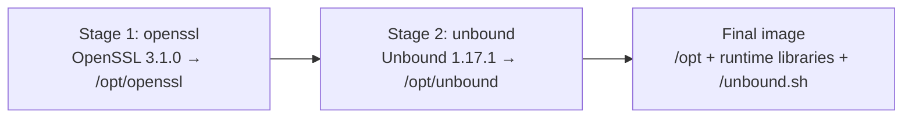

# unbound-docker

[](https://hub.docker.com/r/techblog/unbound-dns)
[](LICENSE)

A Docker image of [Unbound](https://nlnetlabs.nl/projects/unbound/about/), the validating,
recursive and caching DNS resolver from NLnet Labs. Unbound is compiled from source against its
own OpenSSL build (not the distribution's OpenSSL) and runs on a slim Debian base. The image is
published on Docker Hub as [`techblog/unbound-dns`](https://hub.docker.com/r/techblog/unbound-dns).

It is meant for home labs and small networks that want a private DNS resolver, for example as the
upstream for Pi-hole or AdGuard Home. It sizes its caches and threads to the container at
startup, and lets you add local A/PTR, SRV and forwarding records through plain config files.

This project is derived from [MatthewVance/unbound-docker](https://github.com/MatthewVance/unbound-docker).
See [Credits](#credits).

## Table of contents

- [Features](#features)
- [How it works](#how-it-works)
- [Requirements](#requirements)
- [Installation](#installation)
- [Configuration](#configuration)
- [Usage and testing](#usage-and-testing)
- [Troubleshooting](#troubleshooting)
- [Security notes](#security-notes)
- [Development](#development)
- [Contributing](#contributing)
- [Credits](#credits)
- [License](#license)

## Features

- **Unbound 1.17.1** built from the official NLnet Labs tarball, with its SHA-256 checksum verified.
- **OpenSSL 3.1.0** built from source as a static library (`no-shared`), with its checksum and GPG
  signature verified. Weak ciphers and SSLv3 are disabled (`no-weak-ssl-ciphers`, `no-ssl3`),
  heartbeats are compiled out, and the build uses `-fstack-protector-strong`.
- Unbound is built with libevent, libnghttp2 (DNS over HTTPS support), pthreads, and TCP Fast Open
  for both client and server.
- **Automatic tuning** at startup: the message and RRset cache sizes, the thread count and the
  number of cache slabs are calculated from the available memory and CPU count.
- **DNSSEC validation**: the startup script updates the root trust anchor with `unbound-anchor`
  on every start. The built-in script may skip this step; see
  [Known issue: trust anchor](#known-issue-trust-anchor-with-the-built-in-script).
- Hardened defaults: runs chrooted and drops privileges to the `_unbound` user after binding
  port 53, hides identity and version, denies `ANY` queries, strips private addresses from public
  answers (DNS rebinding protection), rate limits recursion and uses QNAME minimisation.
- **Local records** through `a-records.conf` (A and PTR) and `srv-records.conf` (SRV).
- **Forwarding** through `forward-records.conf`. By default, all queries are forwarded to
  Cloudflare over DNS over TLS (port 853).
- A Docker `HEALTHCHECK` that resolves a public name through the local resolver.
- Multi-architecture image: `linux/amd64`, `linux/arm64` and `linux/arm/v7`.

## How it works

The [`Dockerfile`](Dockerfile) is a three-stage build. All stages use `debian:bullseye`.



1. **openssl** downloads OpenSSL, verifies the SHA-256 checksum and the GPG signature, and installs
   it into `/opt/openssl`.
2. **unbound** downloads Unbound, verifies the checksum, and builds it into `/opt/unbound` against
   the static OpenSSL from stage 1. Build flags:

   ```text
   --prefix=/opt/unbound --with-pthreads --with-username=_unbound --with-ssl=/opt/openssl
   --with-libevent --with-libnghttp2 --enable-tfo-server --enable-tfo-client --enable-event-api
   ```

3. The **final image** copies `/opt`, installs the runtime libraries (`libevent`, `libnghttp2`,
   `libexpat`, `ca-certificates`), `bsdmainutils` and `ldnsutils` (for the `drill` command used by the health
   check), creates the `_unbound` user, and copies everything under [`data/`](data) into the image
   root.

At container start, `CMD ["/unbound.sh"]` runs the startup script, which:

1. Reads the available memory (`MemAvailable`, or `MemTotal` as a fallback, from `/proc/meminfo`)
   and lowers it to the cgroup v1 memory limit (`/sys/fs/cgroup/memory/memory.limit_in_bytes`) if
   one is set and smaller.
2. Reserves 12 MiB and exits with `Not enough memory` if 24 MiB or less is available.
3. Calculates the cache sizes and thread settings:

   | Setting | Formula |
   |---|---|
   | `rrset-cache-size` | (available memory − 12 MiB) / 3 |
   | `msg-cache-size` | `rrset-cache-size` / 2 |
   | `num-threads` | CPU count − 1 (1 on a single-CPU host) |
   | `*-cache-slabs` | 2 to the power of round(log2(CPU count)) (4 on a single-CPU host) |

4. Writes `/opt/unbound/etc/unbound/unbound.conf` from a built-in template, **only if that file
   does not already exist**. Mount your own `unbound.conf` to skip the generated one.
5. Copies `/dev/random`, `/dev/urandom` and `/dev/null` into the chroot, creates the `var/`
   directory owned by `_unbound`, and updates the DNSSEC root trust anchor in `var/root.key`
   with `unbound-anchor`. `custom_unbound.sh` (mounted by Compose) creates `unbound.log` first and
   always reaches this step. The built-in `data/unbound.sh` may not; see
   [Known issue: trust anchor](#known-issue-trust-anchor-with-the-built-in-script).
6. Starts Unbound in the foreground: `unbound -d -c /opt/unbound/etc/unbound/unbound.conf`.

### Two startup scripts

The repository contains two versions of the startup script. They share the tuning logic above but
generate different configurations:

| | [`data/unbound.sh`](data/unbound.sh) (built into the image) | [`custom_unbound.sh`](custom_unbound.sh) (mounted by `docker-compose.yaml`) |
|---|---|---|
| Resolution mode | Forwards all queries to the upstreams in `forward-records.conf` (Cloudflare DNS over TLS by default) | Full recursion from the root servers, using `root-hints: var/root.hints` |
| Includes `a-records.conf`, `srv-records.conf`, `forward-records.conf` | Yes | **No** |
| `cache-max-negative-ttl` | Unbound default | `1` |
| `use-caps-for-id` | `yes` | `no` (following the [Pi-hole Unbound guide](https://docs.pi-hole.net/guides/dns/unbound/)) |
| IPv6 `private-address` ranges (`fd00::/8`, `fe80::/10`) | Commented out | Enabled |
| `do-ip6` / `prefer-ip6` | Unbound default | `no` / `no` |
| `private-domain` | Not set | Set to one domain (edit it for your network) |
| Creates `unbound.log` before `chown` | No | Yes |

Both scripts listen on `0.0.0.0@53`, log to `/dev/null` with `verbosity: 0`, disable
`remote-control`, and allow recursion only from `127.0.0.1/32`, `10.0.0.0/8`, `172.16.0.0/12`
and `192.168.0.0/16`.

## Requirements

- Docker (or another OCI runtime). Docker Compose is optional.
- An `amd64`, `arm64` or `armv7` host.
- More than 24 MiB of memory available to the container. The cache is sized from what is
  available, so give it a memory limit if you do not want it to use a third of the host's free
  memory.
- Outbound access to the internet: TCP port 853 to the forwarders (default image), or UDP/TCP
  port 53 to the root and authoritative servers (the Compose setup). `unbound-anchor` also needs
  internet access at startup.

## Installation

### Docker Compose

The [`docker-compose.yaml`](docker-compose.yaml) in this repository runs the published image and
replaces the startup script with [`custom_unbound.sh`](custom_unbound.sh) (full recursion). It
publishes the resolver on host port **5353**:

```yaml
version: '3'
services:
  unbound:
    image: "techblog/unbound-dns"
    container_name: unbound_dns
    hostname: "unbound"
    restart: unless-stopped
    ports:
      - "5353:53/tcp"
      - "5353:53/udp"
    volumes:
      - ./custom_unbound.sh:/unbound.sh:ro
      - ./root.hints:/opt/unbound/etc/unbound/var/root.hints:ro
```

Before you start it, edit the `private-domain:` line in `custom_unbound.sh` to match your own
local domain (or remove it). Then run the following from the repository root:

```bash
docker compose up -d
```

To use the image's built-in script (forwarding over TLS, with the record files) instead, remove
the `custom_unbound.sh` volume line.

### Docker run

With the built-in script and the default forwarders:

```bash
docker run -d \
  --name unbound \
  --restart unless-stopped \
  -p 53:53/tcp \
  -p 53:53/udp \
  techblog/unbound-dns:latest
```

Use `-p 5353:53/tcp -p 5353:53/udp` (or another free port) if port 53 is already in use on the
host.

### Build from source

```bash
git clone https://github.com/t0mer/unbound-docker.git
cd unbound-docker
docker build -t unbound-dns .
```

For a multi-architecture build like the published one, register QEMU emulators and create a
Buildx builder first. A multi-platform image can't be loaded into the local image store, so push
it to a registry (`--push`) or export it (`--output`):

```bash
docker run --privileged --rm tonistiigi/binfmt --install all
docker buildx create --use
docker buildx build --platform linux/amd64,linux/arm64,linux/arm/v7 \
  -t <registry>/<user>/unbound-dns:dev --push .
# or, without a registry:
docker buildx build --platform linux/amd64,linux/arm64,linux/arm/v7 \
  --output type=oci,dest=unbound-dns.tar .
```

## Configuration

### Environment variables

The image reads **no environment variables**. Everything is configured through mounted files.

### Ports

| Container port | Protocol | Purpose |
|---|---|---|
| `53` | TCP and UDP | DNS queries (`interface: 0.0.0.0@53`) |

### Paths inside the container

| Path | Purpose |
|---|---|
| `/unbound.sh` | Startup script. Replace it to change the generated configuration. |
| `/opt/unbound/etc/unbound/unbound.conf` | Main configuration. Generated at startup only if missing; mount your own to replace it. |
| `/opt/unbound/etc/unbound/a-records.conf` | Local A and PTR records (built-in script only). |
| `/opt/unbound/etc/unbound/srv-records.conf` | Local SRV records (built-in script only). |
| `/opt/unbound/etc/unbound/forward-records.conf` | Forward zones (built-in script only). |
| `/opt/unbound/etc/unbound/var/root.hints` | Root server hints, used by `custom_unbound.sh`. |
| `/opt/unbound/etc/unbound/var/root.key` | DNSSEC root trust anchor, written by `unbound-anchor` at startup. |

Unbound runs chrooted in `/opt/unbound/etc/unbound`, so any file it has to read at runtime must
be inside that directory.

> The record files are included only by the built-in [`data/unbound.sh`](data/unbound.sh).
> [`custom_unbound.sh`](custom_unbound.sh), which the Compose file mounts, does not include them.
> To use them with that script, add the matching `include:` lines to its template.

### Local A and PTR records

Create an `a-records.conf` file with `local-data` and `local-data-ptr` entries. The examples use
placeholder names and documentation addresses; replace them with your own:

```text
# A records
    local-data: "nas.example.lan. A 192.0.2.10"
    local-data: "printer.example.lan. A 192.0.2.20"

# PTR records
    local-data-ptr: "192.0.2.10 nas.example.lan."
    local-data-ptr: "192.0.2.20 printer.example.lan."
```

Mount it over the default file:

```bash
docker run -d --name unbound -p 53:53/tcp -p 53:53/udp \
  -v "$(pwd)/a-records.conf:/opt/unbound/etc/unbound/a-records.conf:ro" \
  techblog/unbound-dns:latest
```

### SRV records

Create an `srv-records.conf` file. The format is
`_service._proto.name. TTL class SRV priority weight port target.`:

```text
    local-data: "_ldap._tcp.example.lan. 3600 IN SRV 0 100 389 ldap.example.lan."
```

Mount it at `/opt/unbound/etc/unbound/srv-records.conf`.

### Forward records

The default [`forward-records.conf`](data/opt/unbound/etc/unbound/forward-records.conf) forwards
every query (`name: "."`) over DNS over TLS to Cloudflare (`1.1.1.1` and `1.0.0.1`). It also has
commented-out entries for Cloudflare's malware and family filters, CleanBrowsing, Quad9,
getdnsapi.net and Surfnet. To change the upstreams, copy the file, edit the `forward-addr` lines,
and mount it:

```text
forward-zone:
    name: "."
    forward-tls-upstream: yes
    forward-addr: 9.9.9.9@853#dns.quad9.net
    forward-addr: 149.112.112.112@853#dns.quad9.net
```

```bash
docker run -d --name unbound -p 53:53/tcp -p 53:53/udp \
  -v "$(pwd)/forward-records.conf:/opt/unbound/etc/unbound/forward-records.conf:ro" \
  techblog/unbound-dns:latest
```

To resolve recursively from the root servers instead of forwarding, mount an empty
`forward-records.conf`, or use `custom_unbound.sh` as the Compose file does.

### Root hints

[`root.hints`](root.hints) is a copy of the InterNIC root server list (last updated March 11,
2024). Only `custom_unbound.sh` uses it (`root-hints: var/root.hints`); the Compose file mounts it
read-only at `/opt/unbound/etc/unbound/var/root.hints`. To refresh it:

```bash
curl -o root.hints https://www.internic.net/domain/named.root
```

### Custom unbound.conf

The startup script only writes `unbound.conf` when the file is missing, so a mounted file always
wins. The script still sets up the chroot and runs the trust anchor update (subject to the
[known issue](#known-issue-trust-anchor-with-the-built-in-script) with the built-in script):

```bash
docker run -d --name unbound -p 53:53/tcp -p 53:53/udp \
  -v "$(pwd)/unbound.conf:/opt/unbound/etc/unbound/unbound.conf:ro" \
  techblog/unbound-dns:latest
```

An unmodified copy of the Unbound sample configuration is kept in the image at
`/opt/unbound/etc/unbound/unbound.conf.example`. The full option reference is the
[unbound.conf manual](https://unbound.docs.nlnetlabs.nl/en/latest/manpages/unbound.conf.html).

### Health check

The image defines:

```dockerfile
HEALTHCHECK --interval=30s --timeout=30s --start-period=10s --retries=3 CMD drill @127.0.0.1 cloudflare.com || exit 1
```

The container is reported healthy once it can resolve `cloudflare.com` through itself.

## Usage and testing

Point a client at the host running the container. With the Compose file (port 5353):

```bash
dig @<docker-host-ip> -p 5353 example.com
```

With `docker run` on port 53:

```bash
dig @<docker-host-ip> example.com
```

Check DNSSEC validation. A signed domain returns the `ad` flag, and a deliberately broken one
returns `SERVFAIL`:

```bash
dig @<docker-host-ip> -p 5353 nlnetlabs.nl +dnssec    # look for "flags: ... ad"
dig @<docker-host-ip> -p 5353 dnssec-failed.org       # expect status: SERVFAIL
```

Check a local record from `a-records.conf`:

```bash
dig @<docker-host-ip> nas.example.lan
dig @<docker-host-ip> -x 192.0.2.10
```

From inside the container, `drill` is available. With Docker Compose (service `unbound`,
container `unbound_dns`):

```bash
docker compose exec unbound drill @127.0.0.1 example.com
```

Check the health status:

```bash
docker inspect --format '{{.State.Health.Status}}' unbound_dns
```

For a container started with `docker run --name unbound`, use `docker exec unbound ...` and
`docker inspect ... unbound`.

## Troubleshooting

### Known issue: trust anchor with the built-in script

In [`data/unbound.sh`](data/unbound.sh), the last setup step is a single `&&` chain:
`mkdir var && chown var && chown unbound.log && unbound-anchor`. Nothing creates `unbound.log`
first, so the `chown` of that file fails, the chain stops, and `unbound-anchor` never runs. As a
result, `var/root.key` may be missing. The published image, built after this `chown` was added,
is likely affected. Unbound may then fail to start, or start without DNSSEC validation
<!-- TODO: verify — the resulting Unbound behavior has not been tested -->.

`custom_unbound.sh`, which the Compose file mounts, runs `touch unbound.log` before the `chown`
and is not affected. Until the built-in script is fixed, use the Compose setup or mount a startup
script that creates the file first.

### Other issues

- **Nothing in `docker logs`.** Both scripts set `logfile: /dev/null` and `verbosity: 0`. To debug,
  mount your own `unbound.conf` (or a modified startup script) with `logfile: ""` and a higher
  `verbosity`.
- **`Not enough memory` and the container exits.** The script needs more than 24 MiB available.
  Raise the container's memory limit.
- **The cache uses much more memory than the container limit.** Only the cgroup v1 limit file is
  read. On cgroup v2 hosts (most current distributions), the cache is sized from the host's
  available memory. Set a memory limit and mount your own `unbound.conf` with fixed
  `msg-cache-size` and `rrset-cache-size` values.
- **`REFUSED` answers.** Recursion is allowed only from `127.0.0.1` and the RFC 1918 private ranges.
  Clients outside those ranges (including IPv6 clients) need an `access-control` line in a custom
  `unbound.conf`.
- **Port already in use.** Port 53 is often taken by `systemd-resolved`, and host port 5353 (used by
  the Compose file) by mDNS/Avahi. Publish another host port.
- **Local names resolve to nothing, or private IPs are dropped.** `private-address` removes RFC 1918
  addresses from public answers. Add your internal domain as `private-domain` or define the names
  in `a-records.conf`.
- **Local records have no effect with Docker Compose.** The Compose file mounts
  `custom_unbound.sh`, which does not include the record files. See
  [Two startup scripts](#two-startup-scripts).
- **Changes to the script have no effect.** `unbound.conf` is written only if it does not exist.
  Recreate the container (`docker compose up -d --force-recreate`) so a fresh file is generated.
- **Health check failing.** It needs outbound DNS resolution of `cloudflare.com`. Check the
  container's internet access and the forwarders.

## Security notes

- **Do not expose this resolver to the internet.** An open recursive resolver is abused for DNS
  amplification attacks. Publish port 53 only on internal interfaces (for example
  `-p 192.0.2.1:53:53/udp`) or block it at the firewall.
- Keep `access-control` as narrow as possible. The default allows every RFC 1918 range; restrict it
  to the subnets that actually need it.
- The container starts as root so Unbound can bind port 53, then Unbound chroots to
  `/opt/unbound/etc/unbound` and drops privileges to `_unbound`.
- Remote control (`unbound-control`) is disabled.
- The default forwarding uses DNS over TLS, and the TLS hostnames are verified against the system CA
  bundle (`tls-cert-bundle: /etc/ssl/certs/ca-certificates.crt`).
- The pinned OpenSSL, Unbound and Debian versions are not the latest releases. Rebuild with current
  versions before you rely on this image for anything important.

## Development

Project layout:

```text
.
├── Dockerfile                       # Three-stage build: OpenSSL → Unbound → runtime image
├── VERSION                          # Docker Hub tag used by the workflow (see Release)
├── docker-compose.yaml              # Runs the image with custom_unbound.sh and root.hints
├── custom_unbound.sh                # Alternative startup script (full recursion)
├── root.hints                       # Root server list for custom_unbound.sh
├── data/                            # Copied into the image root
│   ├── unbound.sh                   # Built-in startup script
│   └── opt/unbound/etc/unbound/
│       ├── a-records.conf
│       ├── forward-records.conf
│       └── srv-records.conf
└── .github/workflows/docker-image.yml
```

Build and run locally:

```bash
docker build -t unbound-dns:dev .
docker run --rm -p 5353:53/tcp -p 5353:53/udp unbound-dns:dev
```

To move to a newer release, update `VERSION_OPENSSL`, `SHA256_OPENSSL` and `OPGP_OPENSSL` (the
GPG key fingerprint that signed the OpenSSL release), and `UNBOUND_VERSION`, `UNBOUND_SHA256` and
`UNBOUND_DOWNLOAD_URL` in the `Dockerfile`. The Unbound version also appears in the
`cd unbound-1.17.1` line. Then set `VERSION` to the Unbound version you built.

### Release

The **Docker Build** workflow ([`.github/workflows/docker-image.yml`](.github/workflows/docker-image.yml))
runs on manual dispatch. It is also set to run when a workflow named `Create Release` completes,
but no such workflow exists in this repository. The trigger doesn't check the outcome either, so
it would also fire after a failed run. It builds for
`linux/amd64`, `linux/arm64` and `linux/arm/v7` and pushes two tags to Docker Hub:
`techblog/unbound-dns:latest` and `techblog/unbound-dns:<contents of VERSION>`. It needs the
`DOCKERHUB_USERNAME` and `DOCKERHUB_TOKEN` repository secrets.

> **Version mismatch:** `VERSION` currently says `1.18.1`, but the `Dockerfile` builds Unbound
> `1.17.1`. The next workflow run would publish Unbound 1.17.1 under the `1.18.1` tag. The
> latest tag on Docker Hub is `1.17.1`.

## Contributing

Issues and pull requests are welcome. For changes to the image, build it locally and confirm that
the container becomes healthy and answers `dig` queries before you open a pull request.

## Credits

This project is based on [**MatthewVance/unbound-docker**](https://github.com/MatthewVance/unbound-docker)
by Matthew Vance, published under the [MIT License](https://github.com/MatthewVance/unbound-docker/blob/master/LICENSE)
(Copyright (c) 2022 Matthew Vance). The `Dockerfile`, `data/unbound.sh` and the three record files
come from that project's `1.17.1` directory, and `custom_unbound.sh` appears to be a modified copy of its
startup script. <!-- TODO: verify — custom_unbound.sh carries an "mlee: override" comment, so it may have come through another fork. -->

Changes in this repository compared with the upstream `1.17.1` files:

- Image labels point to `techblog/unbound` and this repository.
- OpenSSL 3.1.0, verified against one GPG key instead of the upstream set of five, built after an
  extra `./Configure linux-x32` step and without `enable-ec_nistp_64_gcc_128`.
- Unbound is built without `--enable-dnstap` and `--enable-subnet`, so the protobuf packages are
  not installed.
- The `_unbound` user is created with `useradd -s /etc -d /dev/null`; upstream uses
  `-s /dev/null -d /etc` (shell and home directory swapped).
- The upstream `LABEL maintainer` lines and the final stage's `ENV NAME`, `SUMMARY` and
  `DESCRIPTION` were removed.
- `data/unbound.sh` adds a commented-out wildcard include and a `chown` of `unbound.log`.
- `forward-records.conf` adds commented-out Surfnet DNS over TLS servers.
- New files: `custom_unbound.sh` (full recursion with root hints and Pi-hole-style tuning),
  `root.hints`, `docker-compose.yaml`, `VERSION` and the Docker Hub workflow.

<details>
<summary>Upstream MIT License (MatthewVance/unbound-docker)</summary>

```text
The MIT License (MIT)

Copyright (c) 2022 Matthew Vance

Permission is hereby granted, free of charge, to any person obtaining a copy
of this software and associated documentation files (the "Software"), to deal
in the Software without restriction, including without limitation the rights
to use, copy, modify, merge, publish, distribute, sublicense, and/or sell
copies of the Software, and to permit persons to whom the Software is
furnished to do so, subject to the following conditions:

The above copyright notice and this permission notice shall be included in
all copies or substantial portions of the Software.

THE SOFTWARE IS PROVIDED "AS IS", WITHOUT WARRANTY OF ANY KIND, EXPRESS OR
IMPLIED, INCLUDING BUT NOT LIMITED TO THE WARRANTIES OF MERCHANTABILITY,
FITNESS FOR A PARTICULAR PURPOSE AND NONINFRINGEMENT. IN NO EVENT SHALL THE
AUTHORS OR COPYRIGHT HOLDERS BE LIABLE FOR ANY CLAIM, DAMAGES OR OTHER
LIABILITY, WHETHER IN AN ACTION OF CONTRACT, TORT OR OTHERWISE, ARISING FROM,
OUT OF OR IN CONNECTION WITH THE SOFTWARE OR THE USE OR OTHER DEALINGS IN
THE SOFTWARE.
```

</details>

Unbound is developed by [NLnet Labs](https://nlnetlabs.nl/), and OpenSSL by the
[OpenSSL Project](https://www.openssl.org/).

## License

This repository is distributed under the [Apache License 2.0](LICENSE). The files derived from
MatthewVance/unbound-docker are also subject to that project's MIT License, whose full text
(copyright notice and permission notice) is reproduced in [Credits](#credits).
<!-- TODO: verify — upstream is MIT, this repo's LICENSE is Apache-2.0, and the Dockerfile label says MIT; the owner should decide the intended licensing for this repository. -->
